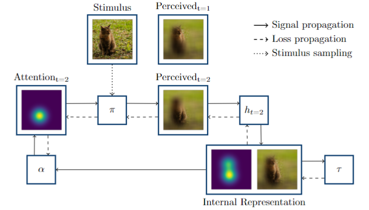
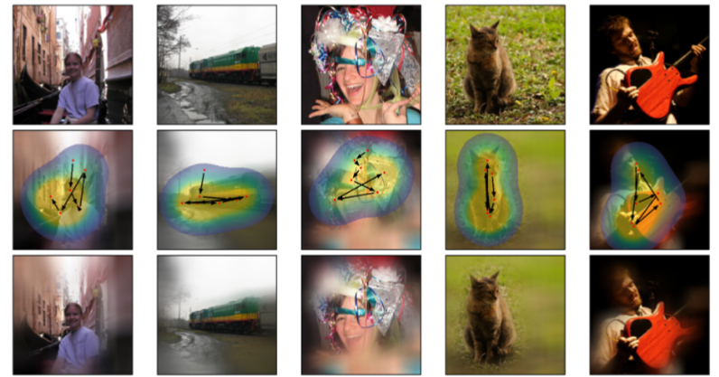

# NeVA

Code relative to "Behind the Machine’s Gaze: Biologically Constrained Neural Networks Exhibit Human-like Visual Attention"
*Leo Schwinn, Doina Precup, Björn Eskofier, and Dario Zanca*

We propose the Neural Visual Attention (NeVA) algorithm, a purely task-driven mechanism of visual attention which operates with imperfect (i.e., foveated) information to generate scanpaths. NeVa utilizes differentiable deep neural networks (i.e., pre-trained for image classification, image reconstruction, or CLIP (https://github.com/openai/CLIP/tree/main/clip)), which convey the concept of visual task in the framework. We define a differentiable layer that simulates the human-like foveation mechanism, which allows for end-to-end training of an attention mechanism guided exclusively by the error signal of the reference task.

An illustration of NeVA is given bellow:



A given stimulus is blurred and subsequently processed by the attention mechanism (α). The attention mechanism calculates an attention position for the foveation mechanism (π). The foveation mechanism deblurrs the image at the attention position and thus creates the perceived stimulus at time t + 1. The perceived stimulus is processed together with the hidden state of the model at time t to obtain the internal representation of the image at time t + 1. Lastly, the loss signal of the task model (τ) for the internal representation is used to assess the quality of the attention position and thus guide and train the attention mechanism.

### Examples

Example scanpaths generated with NeVA:



### Generating Scanpaths

Given a suiteable loss function and tuples of images and targets (e.g., Classification:class labels, Reconstruction:images, CLIP:embedding vectors) NeVA can be used to directly generate scanpaths from a pretrained model:

``` python
from NeVA import NeVAWrapper

NeVA_model = NeVAWrapper(downstream_model=model,
                    criterion=criterion,
                    target_function=target_function,
                    image_size=image_size,
                    foveation_sigma=foveation_sigma,
                    blur_filter_size=blur_filter_size,
                    blur_sigma=blur_sigma,
                    forgetting=forgetting,
                    foveation_aggregation=1,
                    device='cuda')
                   
current_scanpaths, current_loss_history = NeVA_model.run_optimization(images, labels, scanpath_length, optimization_steps, lr)

```

Two examples are given in the files example.py and example_clip.py
